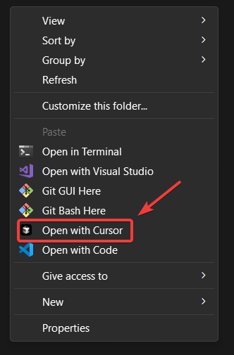

  

    🤝 Show your support - give a ⭐️ if you liked the content
  

  

    
  

---

# 🖱️ Open with Cursor in Context Menu

This project provides PowerShell scripts to add and remove "Open with Cursor" options to the Windows context menu for files, folders, and background areas.

## ✨ Features

- Adds "Open with Cursor" option to:
  - File context menu 📄
  - Folder context menu 📁
  - Background context menu (when right-clicking in an empty area of a folder) 🖼️
- Removes these context menu entries with uninstalling script 🗑️

## 🚀 Installation

1. Download the `install-open-with-cursor.ps1` script.
2. Right-click on the script and select "Run with PowerShell".
3. If prompted, allow the script to run with administrator privileges.

The script will automatically add the "Open with Cursor" options to your context menus. ✅

## 🗑️ Uninstallation

1. Download the `uninstall-open-with-cursor.ps1` script.
2. Right-click on the script and select "Run with PowerShell".
3. If prompted, allow the script to run with administrator privileges.

The script will remove all "Open with Cursor" entries from your context menus. ❌

## 🛠️ How It Works

### Installation Script 📥

The `install-open-with-cursor.ps1` script:

1. Checks for administrator privileges and re-launches with elevated rights if necessary.
2. Locates the Cursor executable in the default installation directory.
3. Adds registry entries for the context menu options.

### Uninstallation Script 🗑️

The `uninstall-open-with-cursor.ps1` script:

1. Checks for administrator privileges and re-launches with elevated rights if necessary.
2. Removes the registry entries added by the installation script.

## 📝 Notes

- Both scripts require administrator privileges to modify the registry.
- The installation script assumes Cursor is installed in its default location. If you've installed Cursor in a different location, you may need to modify the script.

## 🤝 Contributing

Feel free to fork this project and submit pull requests for any improvements or bug fixes.

## 📄 License

This project is open source and available under the [MIT License](LICENSE). 📜
